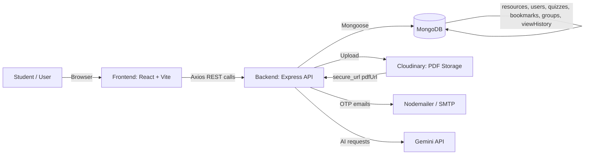
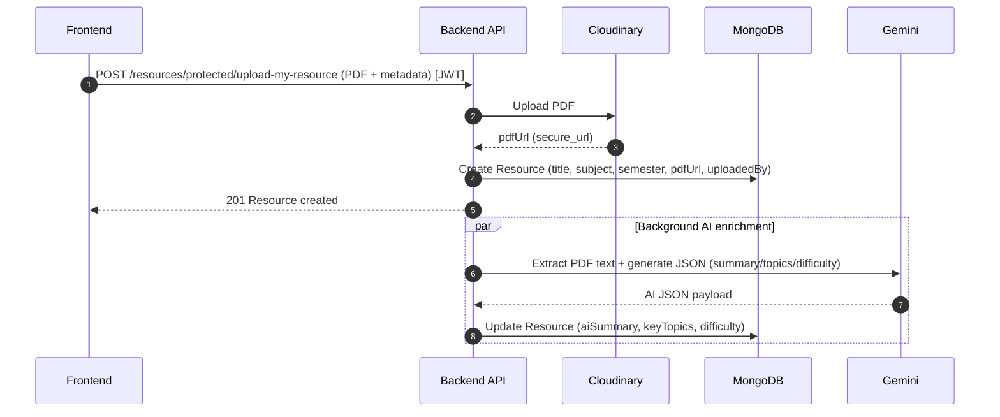
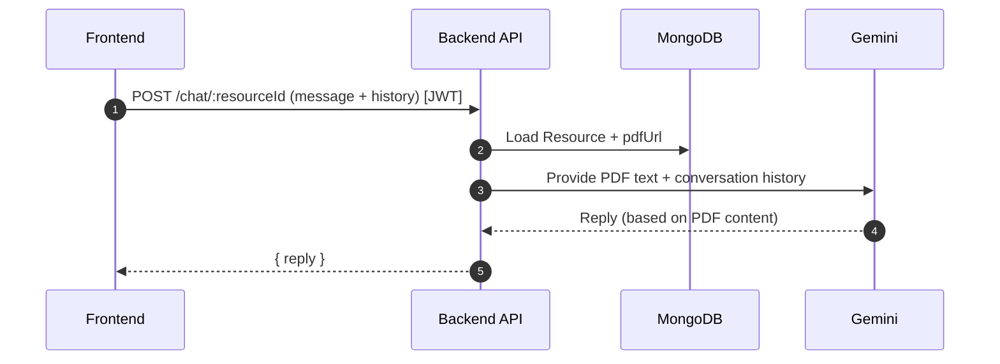
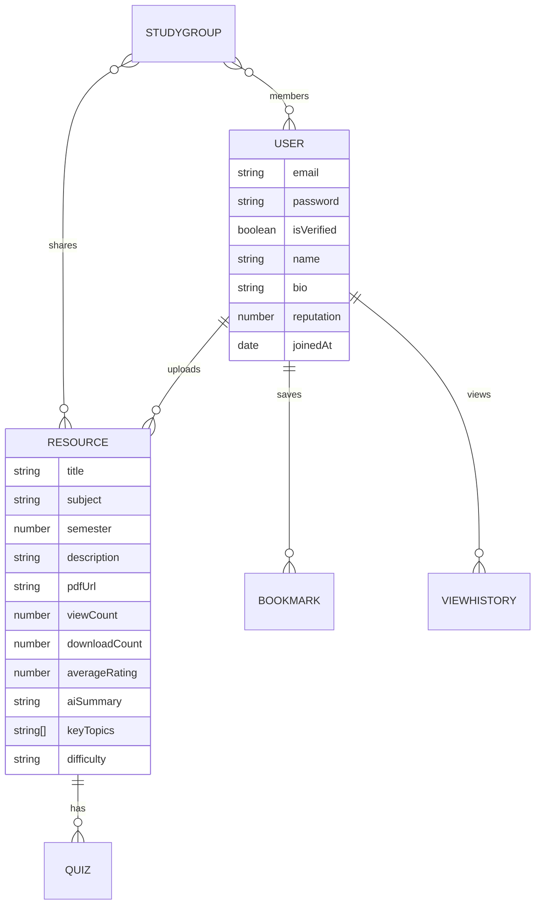

# 📘 Study Vault 

Study Vault is a full-stack MERN platform for **sharing academic PDFs**—built for students who want a dedicated space to **upload notes**, **discover quality resources**, and learn faster with **AI-powered summaries, quizzes, and “chat with PDF”**.

It replaces “lost files in group chats” with a searchable library, quality signals (ratings/reviews), and community features like **bookmarks/collections**, **study groups**, **leaderboards**, and **personal analytics**.

---

## 📌 Table of Contents

- [What’s New in v2.0](#-whats-new-in-v20-major-additions)
- [Product Overview](#-product-overview)
- [How the Full Project Works](#-how-the-full-project-works)
- [Features (Complete List)](#-features-complete-list)
- [Tech Stack](#-tech-stack)
- [Architecture (Diagrams)](#-architecture-flowcharts--diagrams)
- [Data Model (Core Collections)](#-data-model-core-collections)
- [API Reference (Requests & Responses)](#-api-reference-requests--responses)
- [Run Locally](#-running-locally-windows--macos--linux)
- [Production Notes (Deploy Checklist)](#-production-notes-deploy-checklist)
- [Troubleshooting](#-troubleshooting)
- [Demo & Screenshots](#-demo-video--screenshots)
- [Contributing](#-contribute--collaborate)

---

## ✨ What’s New in v2.0 (Major Additions)

- **AI-generated summaries & metadata**: every uploaded PDF can get an **AI Summary**, **Key Topics**, and **Difficulty** (Beginner/Intermediate/Advanced).
- **Chat with PDF (AI)**: ask questions about a document and get answers constrained to its content.
- **Quiz Mode (AI)**: generate and take timed **MCQ quizzes** from any resource; cached per resource, supports regeneration.
- **Bookmarks + Collections**: save resources and organize them into named collections (e.g., “Exam”, “Revision”).
- **Analytics + Gamification**
  - Trending resources
  - Smart recommendations (based on view history)
  - Contributor leaderboard
  - Personal dashboard stats + badges + reputation score
- **Study Groups**: create/join groups via invite code and share resources inside groups.
- **Similar resources**: “you may also like” suggestions by subject/semester.

---

## 🎯 Product Overview

### Who it’s for

- **Students** who want quick access to quality notes, quizzes, and explanations
- **Contributors** who want recognition through reputation/badges and dashboards

### Core objects

- **Resource**: a PDF + metadata + reviews + analytics + AI metadata
- **User**: OTP-verified account with reputation and badges
- **Quiz**: AI-generated MCQs stored per resource
- **Bookmark**: saved resource under a named collection
- **StudyGroup**: invite-code based group with members + shared resources

---

## 🧠 How the Full Project Works

This section explains the *actual runtime behavior* end-to-end (frontend → backend → DB/Cloudinary/AI).

### 1) Authentication (OTP + JWT)

- **Register**: user enters email/password → backend hashes password, generates OTP, emails OTP (expires in ~5 minutes)
- **Verify OTP**: user submits OTP → backend marks user as verified
- **Login**: backend returns a JWT; frontend stores it in `localStorage` and uses it as:
  - `Authorization: Bearer <token>`

### 2) Upload & AI Enrichment (Resources)

- **Upload** (protected):
  - Frontend sends `multipart/form-data` containing `pdf` + metadata
  - Backend uploads to Cloudinary, stores `pdfUrl` + metadata in MongoDB
  - Backend triggers AI enrichment in the background:
    - extracts PDF text (first ~8000 chars used for AI summary/quiz)
    - generates **AI Summary**, **Key Topics**, **Difficulty**
    - updates the resource document

### 3) Explore, Search, Resource Details

- **Explore** (public): browse with pagination and filters
- **Resource detail**:
  - increments `viewCount`
  - if JWT is provided, also writes to `viewHistory` (used for recommendations)
  - shows AI summary/topics/difficulty (if already generated)
  - lets logged-in users review, bookmark, chat, and generate/take quiz

### 4) Reviews & Rating

- Logged-in users submit rating + comment
- Backend recalculates `averageRating` based on all reviews

### 5) Bookmarks & Collections

- Toggle bookmark adds/removes a bookmark row
- Bookmarks can be grouped by **collection** (defaults to `"General"`)

### 6) Analytics, Leaderboard, Badges, Recommendations

- **Trending**: sorts by downloads/views/rating signals + recency boosting
- **Leaderboard**: ranks verified users by reputation score
- **Dashboard**: computes your stats, computes earned badges, stores them on the user, and shows recent views on your resources
- **Recommendations**: based on your recent view history (subject/semester), otherwise fallback to top-rated resources

### 7) Study Groups

- Create group → you become creator + first member; group gets an invite code
- Join group → invite code adds you as a member
- Add resource to group → shares a resource in the group
- Leave group:
  - if last member → group deleted
  - if creator leaves → ownership transfers to first remaining member

---

## 🚀 Features (Complete List)

### Authentication & security

- OTP-based email verification
- JWT-based authentication (Bearer token)
- Protected routes for write actions (upload/update/delete/review/bookmark/groups/chat/quiz)

### Resource management

- Upload PDF resources to Cloudinary
- Update resource metadata and optionally replace the PDF
- Delete your own resources only
- Download tracking
- View tracking

### Discovery & quality

- Public explore/search/filter (title/description + subject + semester)
- Pagination
- Similar resources by subject/semester
- Reviews + star rating with average rating calculation

### AI learning tools

- AI summary generation (stored on resource)
- Key topics extraction (stored on resource)
- Difficulty estimation (stored on resource)
- Chat with PDF (answers constrained to PDF text)
- Quiz Mode: AI-generated MCQs (stored per resource; can regenerate)

### Community & personalization

- Bookmarks with collections
- Study groups with invite code and shared resources
- Profile (edit name/bio; public profile endpoint)
- Personalized recommendations

### Analytics & gamification

- Trending resources
- Contributor leaderboard
- Dashboard stats (uploads/views/downloads/reviews/bookmarks)
- Badges (First Upload, Contributor, Scholar, Reviewer, Popular, Top Rated, Bookworm, Helper)
- Reputation scoring

---

## 🏗️ Architecture (Flowcharts & Diagrams)

### System overview



### Upload → AI enrichment flow



### Chat with PDF flow



---

## 🧬 Data Model (Core Collections)

High-level view of the MongoDB collections used by the backend.



---

## 🧩 Project Structure

```text
Study-Vault-main/
  Backend/
    app.js
    routes/
    controllers/
    middlewares/
    models/
    services/
  Frontend/
    src/
      Components/
      App.jsx
      main.jsx
  Demo_Images/
```

---

## 🚀 Running Locally (Windows / macOS / Linux)

### Prerequisites

- Node.js (LTS recommended)
- MongoDB (Atlas or local)
- Cloudinary account
- Email SMTP credentials (for OTP)
- Gemini API key (for AI features)

### 1) Backend setup

From the project root:

```bash
cd Backend
npm install
```

Create a `Backend/.env` file:

```bash
MONGO_URI=your_mongodb_connection_string
JWT_SECRET=your_jwt_secret

CLOUDINARY_CLOUD_NAME=your_cloud_name
CLOUDINARY_API_KEY=your_api_key
CLOUDINARY_API_SECRET=your_api_secret

EMAIL_OWNER=your_email_address
EMAIL_PASS=your_email_app_password

GEMINI_API_KEY=your_gemini_api_key

# optional
PORT=3000
```

Start the backend (defaults to port **3000**):

```bash
npm start
```

### 2) Frontend setup

In a new terminal:

```bash
cd Frontend
npm install
npm run dev
```

### Important note about API base URL

The frontend currently calls the backend using a hardcoded base URL: **`http://localhost:3000`**.  
For local dev, keep the backend on port **3000** (or update the URLs inside `Frontend/src/Components/*`).

---

## 🔌 API Reference (Requests & Responses)

### Base URL

- **Backend** (local): `http://localhost:3000`
- **API prefix**: `/api/v1`

### Response envelope (important)

This backend does **not** use one single uniform response shape across all endpoints.

- **Success responses** are usually either:
  - a plain object (e.g. `{ reply }`, `{ quiz }`, `{ trending }`)
  - a list (e.g. `[{...resource}]` for `get-my-resources`)
  - or `{ success: true, ... }` for auth
- **Validation errors** thrown by Joi middlewares typically return HTTP **400** with:

```json
{ "error": true, "msg": "validation message here" }
```

- **Not found routes** return HTTP **404** with:

```json
{ "msg": "Route not found" }
```

- **Authorization errors** (missing/invalid JWT) return HTTP **401** or **403** with:

```json
{ "msg": "You need to login first" }
```

Keep that in mind while integrating clients.

### Authentication

#### `POST /api/v1/auth/register`

Registers a user and sends an OTP to email (OTP expires in ~5 minutes).

**Request**

```bash
curl -X POST http://localhost:3000/api/v1/auth/register \
  -H "Content-Type: application/json" \
  -d '{"email":"student@example.com","password":"Pass@1234","name":"Ayush"}'
```

**Response (201)**

```json
{ "success": true, "msg": "OTP sent to student@example.com" }
```

**Response (409)**

```json
{ "success": false, "msg": "User exists already" }
```

#### `POST /api/v1/auth/verify-otp`

**Request**

```bash
curl -X POST http://localhost:3000/api/v1/auth/verify-otp \
  -H "Content-Type: application/json" \
  -d '{"email":"student@example.com","otp":"123456"}'
```

**Response (200)**

```json
{ "success": true, "msg": "Email Verified Successfully" }
```

**Common errors**

- 404 `User not found`
- 410 `OTP is Expired`
- 401 `Invalid OTP`

#### `POST /api/v1/auth/login`

**Request**

```bash
curl -X POST http://localhost:3000/api/v1/auth/login \
  -H "Content-Type: application/json" \
  -d '{"email":"student@example.com","password":"Pass@1234"}'
```

**Response (200)**

```json
{ "success": true, "token": "JWT_TOKEN_HERE" }
```

#### `POST /api/v1/auth/resend-otp`

Resend OTP if the email is registered but not verified.

**Request**

```bash
curl -X POST http://localhost:3000/api/v1/auth/resend-otp \
  -H "Content-Type: application/json" \
  -d '{"email":"student@example.com"}'
```

**Response (200)**

```json
{ "success": true, "msg": "New OTP sent to student@example.com" }
```

**Common errors**

- 400 `Email already verified`
- 404 `User not found`

#### `GET /api/v1/auth/get-user` (Protected)

Returns the logged-in user document.

**Request**

```bash
curl http://localhost:3000/api/v1/auth/get-user \
  -H "Authorization: Bearer JWT_TOKEN_HERE"
```

**Response (200)**

```json
{ "success": true, "user": { "_id": "USER_ID", "email": "student@example.com", "isVerified": true } }
```

#### Auth header (protected routes)

```text
Authorization: Bearer <JWT_TOKEN_HERE>
```

If missing/invalid:

```json
{ "msg": "You need to login first" }
```

---

### Resources (Public)

#### `GET /api/v1/resources/public/get-all-resources`

Query params: `page`, `search`, `subject`, `semester`

**Request**

```bash
curl "http://localhost:3000/api/v1/resources/public/get-all-resources?page=1&search=dbms&subject=&semester="
```

**Response (200)**

```json
{
  "resources": [
    {
      "_id": "RESOURCE_ID",
      "title": "DBMS Unit 1 Notes",
      "subject": "DBMS",
      "semester": 4,
      "description": "Normalized forms summary",
      "pdfUrl": "https://res.cloudinary.com/.../file.pdf",
      "uploadedByEmail": "uploader@example.com",
      "averageRating": 4.5,
      "aiSummary": "",
      "keyTopics": [],
      "difficulty": "",
      "viewCount": 0,
      "downloadCount": 0,
      "createdAt": "2026-05-10T00:00:00.000Z"
    }
  ],
  "totalPages": 3,
  "currentPage": 1
}
```

#### `GET /api/v1/resources/public/get-single-resource/:id`

Increments `viewCount`. If you pass JWT, it also logs view history.

**Request**

```bash
curl http://localhost:3000/api/v1/resources/public/get-single-resource/RESOURCE_ID
```

**Response (200)**

Returns the full resource document.

**Response (404)**

```json
{ "message": "Resource not found" }
```

#### `GET /api/v1/resources/public/similar/:id`

**Request**

```bash
curl http://localhost:3000/api/v1/resources/public/similar/RESOURCE_ID
```

**Response (200)**

```json
{
  "similar": [
    {
      "_id": "RESOURCE_ID",
      "title": "Similar Notes",
      "subject": "DBMS",
      "semester": 4,
      "averageRating": 4.2,
      "viewCount": 10,
      "downloadCount": 5,
      "uploadedByEmail": "uploader@example.com",
      "difficulty": "Intermediate",
      "createdAt": "2026-05-10T00:00:00.000Z"
    }
  ]
}
```

---

### Resources (Protected)

#### `POST /api/v1/resources/protected/upload-my-resource`

Upload a PDF (`pdf`) and metadata.

**Request**

```bash
curl -X POST http://localhost:3000/api/v1/resources/protected/upload-my-resource \
  -H "Authorization: Bearer JWT_TOKEN_HERE" \
  -F "pdf=@/path/to/notes.pdf" \
  -F "title=DBMS Notes" \
  -F "subject=DBMS" \
  -F "semester=4" \
  -F "description=Unit-wise notes"
```

**Response (201)**

Returns the newly created resource document (AI enrichment may appear later).

**Response (400)**

```json
{ "message": "PDF is required" }
```

#### `GET /api/v1/resources/protected/get-my-resources`

Returns resources uploaded by the logged-in user (most recent first).

**Request**

```bash
curl http://localhost:3000/api/v1/resources/protected/get-my-resources \
  -H "Authorization: Bearer JWT_TOKEN_HERE"
```

**Response (200)**

```json
[
  {
    "_id": "RESOURCE_ID",
    "title": "My Notes",
    "subject": "DBMS",
    "semester": 4,
    "pdfUrl": "https://res.cloudinary.com/.../file.pdf",
    "uploadedByEmail": "student@example.com",
    "averageRating": 0,
    "aiSummary": "",
    "keyTopics": [],
    "difficulty": "",
    "viewCount": 0,
    "downloadCount": 0,
    "createdAt": "2026-05-10T00:00:00.000Z"
  }
]
```

#### `PUT /api/v1/resources/protected/update-my-resource/:id`

Update metadata and optionally replace the PDF (multipart).

**Request (metadata only)**

```bash
curl -X PUT http://localhost:3000/api/v1/resources/protected/update-my-resource/RESOURCE_ID \
  -H "Authorization: Bearer JWT_TOKEN_HERE" \
  -F "title=Updated title" \
  -F "description=Updated description"
```

**Request (replace PDF too)**

```bash
curl -X PUT http://localhost:3000/api/v1/resources/protected/update-my-resource/RESOURCE_ID \
  -H "Authorization: Bearer JWT_TOKEN_HERE" \
  -F "pdf=@/path/to/new.pdf" \
  -F "title=Updated title"
```

**Response (200)**

Returns the updated resource document. If PDF was replaced, AI enrichment is re-triggered in the background.

**Response (403)**

```json
{ "message": "Unauthorized" }
```

#### `DELETE /api/v1/resources/protected/delete-my-resource/:id`

Delete one of your uploaded resources.

**Request**

```bash
curl -X DELETE http://localhost:3000/api/v1/resources/protected/delete-my-resource/RESOURCE_ID \
  -H "Authorization: Bearer JWT_TOKEN_HERE"
```

**Response (200)**

```json
{ "message": "Resource deleted successfully" }
```

#### `POST /api/v1/resources/protected/add-review/:id`

**Request**

```bash
curl -X POST http://localhost:3000/api/v1/resources/protected/add-review/RESOURCE_ID \
  -H "Authorization: Bearer JWT_TOKEN_HERE" \
  -H "Content-Type: application/json" \
  -d '{"rating":5,"comment":"Very clear notes"}'
```

**Response (201)**

```json
{ "message": "Review added" }
```

#### `POST /api/v1/resources/protected/track-download/:id`

Increment download count for a resource (used by trending/analytics). Frontend calls this when the user opens the PDF link.

**Request**

```bash
curl -X POST http://localhost:3000/api/v1/resources/protected/track-download/RESOURCE_ID \
  -H "Authorization: Bearer JWT_TOKEN_HERE"
```

**Response (200)**

```json
{ "downloadCount": 12 }
```

---

### Chat with PDF (Protected)

#### `POST /api/v1/chat/:resourceId`

**Request**

```bash
curl -X POST http://localhost:3000/api/v1/chat/RESOURCE_ID \
  -H "Authorization: Bearer JWT_TOKEN_HERE" \
  -H "Content-Type: application/json" \
  -d '{"message":"Explain normalization","history":[]}'
```

**Response (200)**

```json
{ "reply": "..." }
```

**Notes**

- The assistant is instructed to answer **only** from the PDF content.
- If the answer is not present, it may respond with: `"Not found in the document"`.
- If Gemini is rate-limiting or temporarily unavailable, you may receive:

```json
{ "msg": "Gemini API failed. Please wait a moment and try again." }
```

---

### Quiz Mode (Protected)

#### `POST /api/v1/quiz/generate/:resourceId`

Generate a quiz for a resource. If a quiz already exists, the backend returns the cached quiz unless you regenerate.

**Request**

```bash
curl -X POST http://localhost:3000/api/v1/quiz/generate/RESOURCE_ID \
  -H "Authorization: Bearer JWT_TOKEN_HERE"
```

**Response (201)**

```json
{
  "quiz": {
    "_id": "QUIZ_ID",
    "resource": "RESOURCE_ID",
    "questions": [
      {
        "question": "What is ...?",
        "options": ["A", "B", "C", "D"],
        "correctAnswer": 0,
        "explanation": "..."
      }
    ],
    "generatedAt": "2026-05-10T00:00:00.000Z"
  }
}
```

#### Regenerate quiz (force new questions)

**Request**

```bash
curl -X POST "http://localhost:3000/api/v1/quiz/generate/RESOURCE_ID?regenerate=true" \
  -H "Authorization: Bearer JWT_TOKEN_HERE"
```

#### `GET /api/v1/quiz/:resourceId`

**Request**

```bash
curl http://localhost:3000/api/v1/quiz/RESOURCE_ID \
  -H "Authorization: Bearer JWT_TOKEN_HERE"
```

**Response (200)**

```json
{ "quiz": { "_id": "QUIZ_ID", "resource": "RESOURCE_ID", "questions": [] } }
```

**Response (404)**

```json
{ "msg": "No quiz found for this resource. Generate one first." }
```

---

### Bookmarks (Protected)

#### `POST /api/v1/bookmarks/toggle`

**Request**

```bash
curl -X POST http://localhost:3000/api/v1/bookmarks/toggle \
  -H "Authorization: Bearer JWT_TOKEN_HERE" \
  -H "Content-Type: application/json" \
  -d '{"resourceId":"RESOURCE_ID","collection":"Exam"}'
```

**Response (201)**

```json
{ "msg": "Bookmark added", "bookmarked": true }
```

**Response (200)**

```json
{ "msg": "Bookmark removed", "bookmarked": false }
```

#### `GET /api/v1/bookmarks/collections`

**Request**

```bash
curl http://localhost:3000/api/v1/bookmarks/collections \
  -H "Authorization: Bearer JWT_TOKEN_HERE"
```

**Response (200)**

```json
{ "collections": [{ "name": "Exam", "count": 3 }, { "name": "General", "count": 5 }] }
```

#### `GET /api/v1/bookmarks`

List saved bookmarks (optionally filter by collection).

**Request**

```bash
curl "http://localhost:3000/api/v1/bookmarks?collection=Exam" \
  -H "Authorization: Bearer JWT_TOKEN_HERE"
```

**Response (200)**

```json
{ "bookmarks": [{ "_id": "BOOKMARK_ID", "collection": "Exam", "resource": { "_id": "RESOURCE_ID", "title": "..." } }] }
```

#### `GET /api/v1/bookmarks/check/:resourceId`

Checks if the current user has bookmarked a resource.

**Request**

```bash
curl http://localhost:3000/api/v1/bookmarks/check/RESOURCE_ID \
  -H "Authorization: Bearer JWT_TOKEN_HERE"
```

**Response (200)**

```json
{ "bookmarked": true }
```

#### `DELETE /api/v1/bookmarks/:bookmarkId`

Remove a bookmark by ID.

**Request**

```bash
curl -X DELETE http://localhost:3000/api/v1/bookmarks/BOOKMARK_ID \
  -H "Authorization: Bearer JWT_TOKEN_HERE"
```

**Response (200)**

```json
{ "msg": "Bookmark removed" }
```

---

### Study Groups (Protected)

#### `POST /api/v1/groups`

**Request**

```bash
curl -X POST http://localhost:3000/api/v1/groups \
  -H "Authorization: Bearer JWT_TOKEN_HERE" \
  -H "Content-Type: application/json" \
  -d '{"name":"DBMS Squad","description":"Prep together"}'
```

**Response (201)**

```json
{ "group": { "_id": "GROUP_ID", "name": "DBMS Squad", "inviteCode": "A1B2C3D4" } }
```

#### `GET /api/v1/groups`

List groups you created or joined.

**Request**

```bash
curl http://localhost:3000/api/v1/groups \
  -H "Authorization: Bearer JWT_TOKEN_HERE"
```

**Response (200)**

```json
{ "groups": [{ "_id": "GROUP_ID", "name": "DBMS Squad", "inviteCode": "A1B2C3D4" }] }
```

#### `POST /api/v1/groups/join`

Join using invite code.

**Request**

```bash
curl -X POST http://localhost:3000/api/v1/groups/join \
  -H "Authorization: Bearer JWT_TOKEN_HERE" \
  -H "Content-Type: application/json" \
  -d '{"inviteCode":"A1B2C3D4"}'
```

**Response (200)**

```json
{ "msg": "Joined group successfully", "group": { "_id": "GROUP_ID" } }
```

#### `GET /api/v1/groups/:id`

Get group details (members-only).

**Response (200)**

```json
{ "group": { "_id": "GROUP_ID", "members": [], "resources": [] } }
```

#### `POST /api/v1/groups/:id/add-resource`

**Request**

```bash
curl -X POST http://localhost:3000/api/v1/groups/GROUP_ID/add-resource \
  -H "Authorization: Bearer JWT_TOKEN_HERE" \
  -H "Content-Type: application/json" \
  -d '{"resourceId":"RESOURCE_ID"}'
```

**Response (200)**

```json
{ "msg": "Resource added to group" }
```

#### `POST /api/v1/groups/:id/remove-resource`

**Request**

```bash
curl -X POST http://localhost:3000/api/v1/groups/GROUP_ID/remove-resource \
  -H "Authorization: Bearer JWT_TOKEN_HERE" \
  -H "Content-Type: application/json" \
  -d '{"resourceId":"RESOURCE_ID"}'
```

**Response (200)**

```json
{ "msg": "Resource removed from group" }
```

#### `POST /api/v1/groups/:id/leave`

**Request**

```bash
curl -X POST http://localhost:3000/api/v1/groups/GROUP_ID/leave \
  -H "Authorization: Bearer JWT_TOKEN_HERE"
```

**Response (200)**

```json
{ "msg": "Left group successfully" }
```

---

### Analytics

#### `GET /api/v1/analytics/trending`

**Request**

```bash
curl http://localhost:3000/api/v1/analytics/trending
```

**Response (200)**

```json
{ "trending": [{ "_id": "RESOURCE_ID", "title": "..." , "trendingScore": 123 }] }
```

#### `GET /api/v1/analytics/leaderboard`

**Request**

```bash
curl http://localhost:3000/api/v1/analytics/leaderboard
```

**Response (200)**

```json
{ "leaderboard": [{ "_id": "USER_ID", "name": "user", "reputation": 120 }] }
```

#### `GET /api/v1/analytics/dashboard` (Protected)

**Request**

```bash
curl http://localhost:3000/api/v1/analytics/dashboard \
  -H "Authorization: Bearer JWT_TOKEN_HERE"
```

**Response (200)**

```json
{
  "stats": { "totalUploads": 1, "totalDownloads": 10, "totalViews": 20, "totalReviews": 2, "avgRating": 4.5, "bestRating": 5, "totalBookmarks": 3, "reputation": 99 },
  "badges": [{ "name": "First Upload", "icon": "🎯", "earnedAt": "2026-05-10T00:00:00.000Z" }],
  "recentViews": [{ "_id": "VIEW_ID", "resource": { "title": "..." }, "viewedAt": "2026-05-10T00:00:00.000Z" }]
}
```

#### `GET /api/v1/analytics/recommendations` (Protected)

**Request**

```bash
curl http://localhost:3000/api/v1/analytics/recommendations \
  -H "Authorization: Bearer JWT_TOKEN_HERE"
```

**Response (200)**

```json
{ "recommendations": [{ "_id": "RESOURCE_ID", "title": "...", "subject": "...", "semester": 4 }] }
```

---

### Profile

#### `GET /api/v1/profile/me` (Protected)

**Request**

```bash
curl http://localhost:3000/api/v1/profile/me \
  -H "Authorization: Bearer JWT_TOKEN_HERE"
```

**Response (200)**

```json
{
  "user": { "_id": "USER_ID", "email": "student@example.com", "name": "", "bio": "", "badges": [], "reputation": 0, "joinedAt": "2026-05-10T00:00:00.000Z" },
  "stats": { "uploadCount": 1, "totalDownloads": 10, "totalViews": 20, "bookmarkCount": 3 }
}
```

#### `PUT /api/v1/profile/me` (Protected)

Update your profile.

**Request**

```bash
curl -X PUT http://localhost:3000/api/v1/profile/me \
  -H "Authorization: Bearer JWT_TOKEN_HERE" \
  -H "Content-Type: application/json" \
  -d '{"name":"Ayush","bio":"CS student"}'
```

**Response (200)**

```json
{ "msg": "Profile updated", "user": { "name": "Ayush", "bio": "CS student", "email": "student@example.com" } }
```

#### `GET /api/v1/profile/:userId`

Public profile + recent uploads.

**Request**

```bash
curl http://localhost:3000/api/v1/profile/USER_ID
```

**Response (200)**

```json
{ "user": { "_id": "USER_ID", "name": "Ayush", "reputation": 99 }, "uploadCount": 10, "recentResources": [] }
```

---

## 🛡️ Production Notes (Deploy Checklist)

### Backend

- Set all env vars (MongoDB/JWT/Cloudinary/Email/Gemini)
- Restrict CORS to your frontend domain (currently `cors()` allows all)
- Use a production process manager (e.g., platform-managed or `node` start command)
- Add request size/file-size limits (PDF uploads)
- Configure logging (avoid printing secrets)

### Frontend

- Replace hardcoded `http://localhost:3000` with an env-driven base URL (recommended: `VITE_API_BASE_URL`)
- Build with `npm run build` and serve via static host

---

## 🧯 Troubleshooting

- **`MONGO_URI not set`**: create `Backend/.env` and restart backend.
- **OTP not received**:
  - verify `EMAIL_OWNER` / `EMAIL_PASS` (use app password if Gmail)
  - check spam folder
- **401/403 “You need to login first”**:
  - ensure `Authorization: Bearer <token>` is present
  - ensure `JWT_SECRET` matches the one used when token was issued
- **AI features failing**:
  - check `GEMINI_API_KEY`
  - rate limiting can occur (429/503); retry after a short wait

---


---

## 🛠️ Tech Stack

### Frontend

- **React** (via Vite)
- **Vite** dev server + build pipeline
- **React Router DOM** for routing
- **Axios** for REST API calls
- **CSS** for styling (component-level styles)

### Backend

- **Node.js** + **Express**
- **MongoDB** + **Mongoose**
- **JWT** (Bearer token auth)
- **OTP email verification** (Nodemailer)
- **Validation** (Joi)
- **Uploads**: Multer → Cloudinary → saved `pdfUrl` in MongoDB
- **Error handling**: express-async-errors + centralized middleware

### AI / ML

- **Gemini API**:
  - AI summaries + key topics + difficulty
  - quiz generation (MCQ)
  - chat with PDF (answers restricted to document content)

### Dev tooling / scripts

- **Frontend**
  - `npm run dev` (local dev)
  - `npm run build` (production build)
  - `npm run lint`
  - `npm run preview`
- **Backend**
  - `npm start` (nodemon)

---

## 🤝 Contribute & Collaborate

Pull requests and improvements are welcome—especially around:

- Making the frontend API base URL configurable (instead of hardcoded)
- Adding tests (API + UI)
- Deployment docs (Vercel/Render + env configuration)
- Moderation features (reporting, spam filtering) and role-based access control

---

## Owner

-- Ayush Palkhe

## Happy Coding !!

